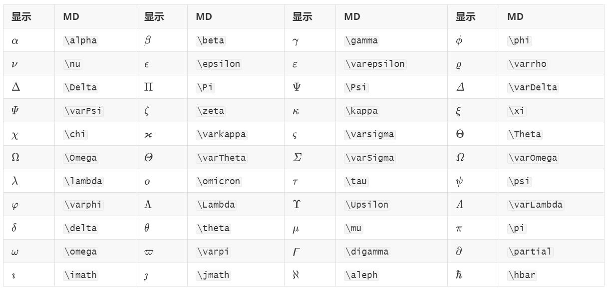
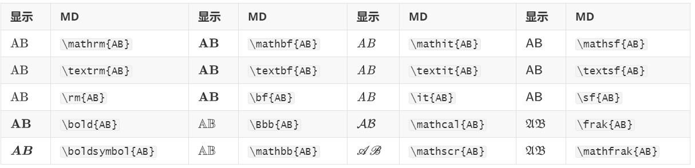
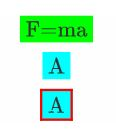
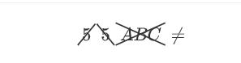

# Typora 的 Markdown 语法

## 概述

**Markdown** 由 [Daring Fireball](http://daringfireball.net/) 创建，原始指南在 [这里](http://daringfireball.net/projects/markdown/syntax)。但是，它的语法因不同的解析器或编辑器而异。**Typora** 正在使用 [GitHub Flavored Markdown](https://help.github.com/articles/github-flavored-markdown/)。

## 块元素

### 段落和换行符

段落只是一行或多行连续的文本。在 markdown 源代码中，段落由多个空行分隔。在Typora中，您只需按下 `Return` 即可创建新段落。

按 `Shift` + `Return` 可创建单个换行符。但是，大多数 markdown 解析器将忽略单行中断，要使其他 markdown 解析器识别您的换行符，可以在行尾留下两个空格，或者插入 `<br/>`.

### 标题

标题在行的开头使用1-6个＃字符，对应于标题级别1-6。例如：

```
# 这是一级标题

## 这是二级标题

###### 这是六级标题
```

在typora中，输入’＃’后跟标题内容，按下 `Return` 键将创建标题。

### 引用文字

Markdown 使用电子邮件样式>字符进行块引用。它们表示为：

```
> 这是一个有两段的块引用。这是第一段。
>
> 这是第二段。Vestibulum enim wisi, viverra nec, fringilla in, laoreet vitae, risus.


> 这是另一个只有一个段落的块引用。有三个空行分隔两个块引用。
```

在typora中，只需输入’>’后跟引用内容即可生成块引用。Typora将为您插入正确的“>”或换行符。通过添加额外级别的“>”允许在块引用内嵌入另一个块引用。

### 列表

输入 `* list item 1` 将创建一个无序列表，该 `*` 符号可以替换为 `+` 或 `-`.

输入 `1. list item 1` 将创建一个有序列表，其 markdown 源代码如下：

```
## 无序列表
*   红色
*   绿色
*   蓝色

## 有序列表
1.  红色
2. 	绿色
3.	蓝色
```

### 任务列表

任务列表是标记为[ ]或[x]（未完成或完成）的项目的列表。例如：

```
- [ ] 这是一个任务列表项
- [ ] 需要在前面使用列表的语法
- [ ] normal **formatting**, @mentions, #1234 refs
- [ ] 未完成
- [x] 完成
```

您可以通过单击项目前面的复选框来更改完成/未完成状态。

### （栅栏式）代码块

Typora仅支持 Github Flavored Markdown 中的栅栏式代码块。不支持 markdown 中的原始代码块。

使用栅栏式代码块很简单：输入```之后输入一个可选的语言标识符，然后按`return`键后输入代码，我们将通过语法高亮显示它：

~~~gfm
这是一个例子：

```
function test() {
  console.log("notice the blank line before this function?");
}
```

语法高亮：
```ruby
require 'redcarpet'
markdown = Redcarpet.new("Hello World!")
puts markdown.to_html
```
~~~

### 数学公式块

您可以使用 **MathJax** 渲染 *LaTeX* 数学表达式。

输入 `$$`, 然后按“return”键将触发一个接受*Tex / LaTex*源代码的输入区域。以下是一个例子： V1×V2=∣∣∣∣∣i∂X∂u∂X∂vj∂Y∂u∂Y∂vk00∣∣∣∣∣�1×�2=|���∂�∂�∂�∂�0∂�∂�∂�∂�0|

在 markdown 源文件中，数学公式块是由’$$’标记包装的 *LaTeX* 表达式：

```
$$
\mathbf{V}_1 \times \mathbf{V}_2 =  \begin{vmatrix} 
\mathbf{i} & \mathbf{j} & \mathbf{k} \\
\frac{\partial X}{\partial u} &  \frac{\partial Y}{\partial u} & 0 \\
\frac{\partial X}{\partial v} &  \frac{\partial Y}{\partial v} & 0 \\
\end{vmatrix}
$$
```

### 表格

输入 `| First Header | Second Header |` 并按下 `return` 键将创建一个包含两列的表。

创建表后，焦点在该表上将弹出一个表格工具栏，您可以在其中调整表格，对齐或删除表格。您还可以使用上下文菜单来复制和添加/删除列/行。

可以跳过以下描述，因为表格的 markdown 源代码是由typora自动生成的。

在 markdown 源代码中，它们看起来像这样：

```
| First Header  | Second Header |
| ------------- | ------------- |
| Content Cell  | Content Cell  |
| Content Cell  | Content Cell  |
```

您还可以在表格中包括内联 Markdown 语法，例如链接，粗体，斜体或删除线。

最后，通过在标题行中包含冒号：您可以将文本定义为左对齐，右对齐或居中对齐：

```
| Left-Aligned  | Center Aligned  | Right Aligned |
| :------------ |:---------------:| -----:|
| col 3 is      | some wordy text | $1600 |
| col 2 is      | centered        |   $12 |
| zebra stripes | are neat        |    $1 |
```

最左侧的冒号表示左对齐的列; 最右侧的冒号表示右对齐的列; 两侧的冒号表示中心对齐的列。

### 脚注

```
您可以像这样创建脚注[^footnote].

[^footnote]: Here is the *text* of the **footnote**.
```

将产生：

您可以像这样创建脚注[1](https://support.typoraio.cn/zh/Markdown-Reference/#fn:footnote).

鼠标移动到‘footnote’上标中查看脚注的内容。

### 水平线

输入 `***` 或 `---` 在空行上按 `return` 键将绘制一条水平线。

------

### YAML Front Matter

Typora 现在支持 [YAML Front Matter](http://jekyllrb.com/docs/frontmatter/) 。 在文章顶部输入 `---` 然后按 `Enter` 键将引入一个，或者从菜单中插入一个元数据块。

### 目录 (TOC)

输入 `[toc]` 然后按 `Return` 键将创建一个“目录”部分，自动从文档内容中提取所有标题，其内容会自动更新。

### 图表 (Sequence, Flowchart and Mermaid)

Typora 支持, [sequence](https://bramp.github.io/js-sequence-diagrams/), [flowchart](http://flowchart.js.org/) and [mermaid](https://knsv.github.io/mermaid/#mermaid), 使用前要先从偏好设置面板启用该功能。

详细信息请参阅此 [文档](http://support.typora.io/Draw-Diagrams-With-Markdown/)

## Span 元素

在您输入后Span元素会被立即解析并呈现。在这些span元素上移动光标会将这些元素扩展为markdown源代码。以下将解释这些span元素的语法。

### 链接

Markdown 支持两种类型的链接：内联和引用。

在这两种样式中，链接文本都写在[方括号]内。

要创建内联链接，请在链接文本的结束方括号后立即使用一组常规括号。在常规括号内，输入URL地址，以及可选的用引号括起来的链接标题。例如：

```
This is [an example](http://example.com/ "Title") inline link.

[This link](http://example.net/) has no title attribute.
```

将产生：

This is [an example](http://example.com/"Title") inline link. (`<p>This is <a href="http://example.com/" title="Title">`)

[This link](http://example.net/) has no title attribute. (`<p><a href="http://example.net/">This link</a> has no`)

#### 内部链接

**您可以将常规括号内的 href 设置为文档内的某一个标题**，这将创建一个书签，允许您在单击后跳转到该部分。例如：

Command(在Windows上：Ctrl) + 单击 [此链接](https://support.typoraio.cn/zh/Markdown-Reference/#块元素) 将跳转到标题 `块元素`处。 要查看如何编写，请移动光标或按住 `⌘` 键单击以将元素展开为 Markdown 源代码。

#### 参考链接

参考样式链接使用第二组方括号，在其中放置您选择的标签以标识链接：

```
This is [an example][id] reference-style link.

然后，在文档中的任何位置，您可以单独定义链接标签，如下所示：

[id]: http://example.com/  "Optional Title Here"
```

在typora中，它们将呈现为：

This is [an example](http://example.com/) reference-style link.

隐式链接名称快捷方式允许您省略链接的名称，在这种情况下，链接文本本身将用作名称。只需使用一组空的方括号，例如，将“Google”一词链接到google.com网站，您只需写下：

```
[Google][]
然后定义链接：

[Google]: http://google.com/
```

在typora中单击链接将其展开以进行编辑，command + 单击将在 Web 浏览器中打开超链接。

### URL网址

Typora允许您将 URL 作为链接插入，用 `<`括号括起来`>`。

`<i@typora.io>` 成为 [i@typora.io](mailto:i@typora.io).

Typora也将自动链接标准URL。例如： www.google.com.

### 图片

图像与链接类似， 但在链接语法之前需要添加额外的 `!` 字符。 图像语法如下所示：

```


```

您可以使用拖放操作从图像文件或浏览器来插入图像。并通过单击图像修改 markdown 源代码。如果图像在拖放时与当前编辑文档位于同一目录或子目录中，则将使用相对路径。

有关图像的更多提示，请阅读 http://support.typora.io//Images/

### 强调（斜体）

Markdown 将星号 (`*`) 和下划线(`_`) 视为强调的指示。用一个 `*` or `_` 包裹文本将使用HTML `<em>` 标签包裹文本。例如：

```
*单个星号*

_单个下划线_
```

输出：

*单个星号*

*单个下划线*

GFM将忽略单词中的下划线，这通常用在代码和名称中，如下所示：

> wow_great_stuff
>
> do_this_and_do_that_and_another_thing.

要在用作强调分隔符的位置生成文字星号或下划线，可以用反斜杠转义：

```
\*这个文字被文字星号包围\*
```

Typora建议使用 `*` 号.

### 粗体

用两个 * 或 _ 包裹的文本将使用HTML `<strong>` 标签包裹，例如：

```
**双星号**

__双重下划线__
```

输出：

**双星号**

**双重下划线**

Typora 建议使用 `**` 号。

### 代码

要指示代码范围，请使用反引号（`）进行包裹。与预格式化的代码块不同，代码跨度表示正常段落中的代码。例如：

```
使用`printf()`函数。
```

将产生：

使用 `printf()` 函数。

### 删除线

GFM通过添加语法来创建删除线文本，标准的Markdown中缺少该文本。

`~~错误的文字。~~` 变成 ~~错误的文字。~~

### 下划线

下划线由原始HTML提供支持。

`<u>下划线</u>` 变成 下划线

### 表情符号 :smile:

输入表情符号的语法是 `:smile:`

用户可以通过 `ESC` 按键触发表情符号的自动完成建议，或者在偏好设置面板里启用后自动触发表情符号。此外，还支持直接从 `Edit` -> `Emoji & Symbols` 菜单栏输入UTF8表情符号字符。

### 内联数学公式

要使用此功能，首先，请在 `偏好设置` 面板 -> `Markdown扩展语法` 选项卡中启用它。然后使用 `$` 来包裹TeX命令，例如： `$\lim_{x \to \infty} \exp(-x) = 0$` 将呈现为LaTeX命令。

要触发内联公式的预览提示功能：输入“$”, 然后按 `ESC` 键, 然后输入TeX命令, 预览工具提示将如下所示：


### 下标

要使用此功能，首先，请在 `偏好设置` 面板 -> `Markdown扩展语法` 选项卡中启用它。然后用 `~` 来包裹下标内容，例如： `H~2~O`, `X~long\ text~`/

### 上标

要使用此功能，首先，请在 `偏好设置` 面板 -> `Markdown扩展语法` 选项卡中启用它。然后用 `^` 来包裹上标内容，例如： `X^2^`。

### 高亮

要使用此功能，首先，请在 `偏好设置` 面板 -> `Markdown扩展语法` 选项卡中启用它。然后用 `==` 来包裹高亮内容，例如： `==highlight==`。

## HTML

您可以使用HTML来设置纯 Markdown 不支持的内容，例如， `<span style="color:red">this text is red</span>` 用于添加红色文本。

### 嵌入内容

有些网站提供基于iframe的嵌入代码，您也可以将其粘贴到Typora中，例如：

```Markdown
<iframe height='265' scrolling='no' title='Fancy Animated SVG Menu' src='http://codepen.io/jeangontijo/embed/OxVywj/?height=265&theme-id=0&default-tab=css,result&embed-version=2' frameborder='no' allowtransparency='true' allowfullscreen='true' style='width: 100%;'></iframe>
```

### 视频

您可以使用 `<video>` HTML标记嵌入视频，例如：

```Markdown
<video src="xxx.mp4" />
```

### 其他 HTML 支持

你可以在 [这里](http://support.typora.io/HTML/)找到细节。

1. Here is the *text* of the **footnote**. [↩](https://support.typoraio.cn/zh/Markdown-Reference/#fnref:footnote)


# typora使用

2020-10-20 by Typora.net

1. 菜单 [toc]
2. 标题 # ~ ###### （1-6个级别）
3. 引注 开头> 空格+文字 双按换行跳出
4. 序列 开头*/+/-，空格+文字，可以创建无序序列，换行键换行，删除键+shift+tab跳出 开头1.，空格+后接文字，可以创建有序序列
5. 可选序列 开头序列+空格+[ ]+空格+文字，换行键换行，删除键+shift+tab跳出
6. 代码块 开头“`+语言名，开启代码块，换行键换行，光标下移键跳出
7. 数学块 开头$$+换行键，产生输入区域，输入Tex/LaTex格式的数学公式
8. 表格 开头|+列名+|+列名+|+换行键
9. 脚注 在需要添加脚注的文字后面+[+^+序列+]，注释的产生可以鼠标放置其上单击自动产生，添加信息或人工添加+[+^+序列+]+:
10. 水平线 输入***/—，换行键换行
11. 链接 单击链接，展开后可编辑 ctr+单击，打开链接
12. 超链接 用[]括住要超链接的内容，紧接着用()括住超链接源+名字，超链接源后面+超链接命名
13. 内链接 相关链 使用[+超链接文字+]+[+标签+]，创建可定义链接
14. URLs 用<>括住url，可手动设置url （对于标准URLs，可自动识别）
15. 图片 手动添加：类似链接，前面需加！
16. 斜体 以**或__括住，建议双*
17. 加粗 开头双*或双_，结尾双*或双_，建议双*
18. 删除线 用两个~开头，两个~结尾
19. 下划线 使用HTML标签<u>M</u>
20. 代码 用两个`在正常段落总表示代码
21. 数学式 需 Preference Panel -> Markdown Tab启动， 输入$，然后按ESC键，之后输入Tex命令，可预览
22. 高亮 需 Preference Panel -> Markdown Tab启动，使用双==括住内容
23. 下标 上标 需 Preference Panel -> Markdown Tab启动，使用双~括住内容 使用双^括住内容
24. 多行无序列表 TAB * 多行无序列表2
25. 任务列表 -[x] 喝酒
26. 特殊字符

&copy; 版权
&reg; 注册商标
&trade; 商标
&nbsp; 空格
&amp; 和号
&quot; 引号
&apos; 撇号
&lt; 小于号
&gt; 大于号
&ne; 不等号
&le; 小于等于
&ge; 大于等于
&cent; 分
&pound; 磅
&euro; 欧元
&yen; 元
&sect; 节
&times; 乘号
&divide; 除号
&plusmn; 正负号

# [typora常用的数学公式编辑语法](https://www.cnblogs.com/wreng/articles/13514391.html)


目录

- 基本格式
  - [上下标](https://www.cnblogs.com/wreng/articles/13514391.html#上下标)
  - [分数](https://www.cnblogs.com/wreng/articles/13514391.html#分数)
  - [开根](https://www.cnblogs.com/wreng/articles/13514391.html#开根)
  - [组合数](https://www.cnblogs.com/wreng/articles/13514391.html#组合数)
  - [导数](https://www.cnblogs.com/wreng/articles/13514391.html#导数)
  - [偏微分](https://www.cnblogs.com/wreng/articles/13514391.html#偏微分)
  - [取模](https://www.cnblogs.com/wreng/articles/13514391.html#取模)
  - [积分](https://www.cnblogs.com/wreng/articles/13514391.html#积分)
  - [累加/累乘/极限](https://www.cnblogs.com/wreng/articles/13514391.html#累加累乘极限)
- [修饰符号](https://www.cnblogs.com/wreng/articles/13514391.html#修饰符号)
- [各种括号](https://www.cnblogs.com/wreng/articles/13514391.html#各种括号)
- [希腊字母](https://www.cnblogs.com/wreng/articles/13514391.html#希腊字母)
- [算术运算符](https://www.cnblogs.com/wreng/articles/13514391.html#算术运算符)
- [比较运算符](https://www.cnblogs.com/wreng/articles/13514391.html#比较运算符)
- [集合/逻辑相关](https://www.cnblogs.com/wreng/articles/13514391.html#集合逻辑相关)
- [各种箭头](https://www.cnblogs.com/wreng/articles/13514391.html#各种箭头)
- [空格间距](https://www.cnblogs.com/wreng/articles/13514391.html#空格间距)
- [矩阵](https://www.cnblogs.com/wreng/articles/13514391.html#矩阵)
- [列式/方程组](https://www.cnblogs.com/wreng/articles/13514391.html#列式方程组)
- 字体操作
  - [修改字体](https://www.cnblogs.com/wreng/articles/13514391.html#修改字体)
  - [修改大小](https://www.cnblogs.com/wreng/articles/13514391.html#修改大小)
  - [修改颜色](https://www.cnblogs.com/wreng/articles/13514391.html#修改颜色)
  - [划掉](https://www.cnblogs.com/wreng/articles/13514391.html#划掉)
- [常见图形](https://www.cnblogs.com/wreng/articles/13514391.html#常见图形)
- [声明宏](https://www.cnblogs.com/wreng/articles/13514391.html#声明宏)
- [参考资料](https://www.cnblogs.com/wreng/articles/13514391.html#参考资料)


# 基本格式

## 上下标


A21B122x2+y�12�122�2+�


```mipsasm
A_1^2
\\
B_{12}
\\
2^{x^2+y}
```

## 分数


x1+x212+xyabab�1+�212+������


```fsharp
\frac{x}{1+x^2}
\\
\frac{\frac{1}{2}+x}{y}
\\
\tfrac{a}{b}
\frac{a}{b}
```

## 开根


√x3√x��3


```markdown
\sqrt{x}
\sqrt[3]{x}
```

## 组合数


(nk)(nk)(��)(��)


```fsharp
\binom{n}{k}
\tbinom{n}{k}
```

## 导数


a′a′′a′�′�″�′


## 偏微分


∂∇∂∇


```markdwon
a'
a''
a^{\prime}
```

## 取模


x(moda)2modx�(mod�)2mod�


```css
x \pmod a
\\
2\mod{x}
```

## 积分


∫211∫2∮∫∬∯∭∰∫12∫21∮⁡∫∬∯⁡∭∰


\oiint和\oiiint在博客园中不能使用，对应的是带圆圈的二重和三重积分

```fsharp
\int_{1}^{2}
\intop_{2}^{1}
\oint
\smallint
\\
\iint
\oiint
\iiint
\oiiint
```

## 累加/累乘/极限


k∑i=1n∑i=1∑ni=1k∏i=1n∏i=1∏ni=1limk→∞limk→∞limk→∞∑�=1�∑�=1�∑�=1�∏�=1�∏�=1�∏�=1�lim�→∞lim�→∞lim�→∞


```fsharp
\sum_{i=1}^{k}
\displaystyle\sum_{i=1}^n
\textstyle\sum_{i=1}^n
\\
\prod_{i=1}^{k}
\displaystyle\prod_{i=1}^n
\textstyle\prod_{i=1}^n
\\
\lim_{k \to \infty}
\lim\limits_{k \to \infty}
\lim\nolimits_{k \to \infty}
```

# 修饰符号

**简单的帽子**


^θˆAB¯y¯¯¯¯¯¯¯¯AB~a˜ac¯a´aˇa`a˙a¨a�^��^�¯��¯�~��~�¯�´�ˇ�`�˙�¨


```markdopwn
\hat{\theta}
\widehat{AB}
\\
\bar{y}
\overline{AB}
\\
\tilde{a}
\widetilde{ac}
\\
\bar{a}
\acute{a}
\check{a}
\grave{a}
\\
\dot{a}
\ddot{a}
```

**帽子和袜子**


←−−AB−−→AB←→ABAB←−−AB−−→AB←→ABAB¯¯¯¯¯¯¯¯ABAB––––��←��→��↔��←��→��↔��⏞��⏟��¯��_


```markdown
\overleftarrow{AB}
\overrightarrow{AB}
\overleftrightarrow{AB}
\\
\underleftarrow{AB}
\underrightarrow{AB}
\underleftrightarrow{AB}
\\
\overbrace{AB}
\underbrace{AB}
\\
\overline{AB}
\underline{AB}
```

**盖子和盒子**


notea+b+ca+b+cnoteπ=3.14�+�+�⏞note�+�+�⏟note�=3.14


```fsharp
\overbrace{a+b+c}^{\text{note}}
\\
\underbrace{a+b+c}_{\text{note}}
\\
\boxed{\pi=3.14}
```

# 各种括号


((((((((((


```mipsasm
(
\big(
\Big(
\bigg(
\Bigg(
```


[]<>|−2|{}[]<>|−2|{}


```xml
[]
<>
|-2|
\{\}
```


⟮x⟯∥a∥⌈2.6⌉⌊1.2⌋⟮�⟯‖�‖⌈2.6⌉⌊1.2⌋


```css
\lgroup x \rgroup
\lVert a \rVert
\lceil 2.6 \rceil
\lfloor 1.2 \rfloor
```


┌┐└┘⌜⌝⌞⌟


```mipsasm
\ulcorner
\urcorner
\llcorner
\lrcorner
```

# 希腊字母



# 算术运算符


+−×/÷⋅#%+−×/÷⋅#%


```bash
+
-
\times
/
\div
\cdot
\#
\%
```


∩∪∧∨⊔⊓∩∪∧∨⊔⊓


```bash
\cap
\cup
\land
\lor
\sqcup
\sqcap
```


∘∗⋆⊗⊕⊙∘∗⋆⊗⊕⊙


```undefined
\circ
\ast
\star
\otimes
\oplus
\odot
```


±∓∔⋇±∓∔⋇


```mipsasm
\pm
\mp
\dotplus
\divideontimes
```

# 比较运算符


==≢≈≊≅∼==≢≈≊≅∼


```undefined
=
= \not
\equiv
\approx
\approxeq
\cong
\sim
```


<>≤≥≫≪<>≤≥≫≪


```markdown
<
>
\le
\ge
\gg
\ll
```


⋞⋟≺≻⪯⪰⋞⋟≺≻⪯⪰


```undefined
\curlyeqprec
\curlyeqsucc
\prec
\succ
\preceq
\succeq
```

# 集合/逻辑相关


∈∋⊄⊅⊆⊇∩∪∧∨¬∅∅∵∀∃∴∈∋⊄⊅⊆⊇∩∪∧∨¬∅∅∵∀∃∴


```mipsasm
\in
\owns \not
\subset \not
\supset
\subseteq
\supseteq
\\
\cap
\cup
\land
\lor
\\
\neg
\emptyset
\varnothing
\\
\because
\forall
\exists
\therefore
```

# 各种箭头

**细箭头**


←←→→↔↑↓↕←←→→↔↑↓↕


```css
\gets
\leftarrow
\to
\rightarrow
\leftrightarrow
\\
\uparrow
\downarrow
\updownarrow
```

**粗箭头**


⇐⇒⇔⟺⇑⇓⇕⇐⇒⇔⟺⇑⇓⇕


```verilog
\Leftarrow
\Rightarrow
\Leftrightarrow
\iff
\\
\Uparrow
\Downarrow
\Updownarrow
```

**斜箭头**


↗↘↙↖↗↘↙↖


```mipsasm
\nearrow
\searrow
\swarrow
\nwarrow
```

**半边箭头**


↼↽⇀⇁⇌↼↽⇀⇁⇌


```undefined
\leftharpoonup
\leftharpoondown
\rightharpoonup
\rightharpoondown
\rightleftharpoons
```

**特殊箭头**


↦⇝↩↪↦⇝↩↪


```undefined
\mapsto
\leadsto
\hookleftarrow
\hookrightarrow
```

**加长箭头**


⟵⟶⟷⟸⟹⟺⟼⟵⟶⟷⟸⟹⟺⟼


```undefined
\longleftarrow
\longrightarrow
\longleftrightarrow
\Longleftarrow
\Longrightarrow
\Longleftrightarrow
\longmapsto
```

**带文本箭头**


over−−→−−→overover−−−→underover←−−←−−−underover←−−−under→����→����→���������←����←�����←���������


```css
\xrightarrow{over}
\xrightarrow[over]{}
\xrightarrow[under]{over}
\xleftarrow[]{over}
\xleftarrow[under]{}
\xleftarrow[under]{over}
```

# 空格间距


ABABABABA BABABAB��������� �������


```markdown
A\!B
\\
AB
\\
A\thinspace B
\\
A\:B
\\
A\ B
\\
A \enspace B
\\
A\quad B
\\
A\qquad B
```

# 矩阵


A=abcd�=����


```ruby
A = \begin{matrix}
a & b\\
c & d
\end{matrix}
```


B=(abcd)�=(����)


```mipsasm
B = \begin{pmatrix}
a & b\\
c & d
\end{pmatrix}
```


C=∣∣∣abcd∣∣∣�=|����|


```ruby
C = \begin{vmatrix}
a & b\\
c & d
\end{vmatrix}
```


D=[abcd]�=[����]


```mipsasm
D = \begin{bmatrix}
a & b\\
c & d
\end{bmatrix}
```


E=∥∥∥abcd∥∥∥�=‖����‖


```ruby
E = \begin{Vmatrix}
a & b\\
c & d
\end{Vmatrix}
```


F={abcd}�={����}


```mipsasm
F = \begin{Bmatrix}
a & b\\
c & d
\end{Bmatrix}
```


[A b]=⎡⎢ ⎢⎣a11a12a13b1a21a22a23b2a31a32a33b3⎤⎥ ⎥⎦[� �]=[�11�12�13�1�21�22�23�2�31�32�33�3]


```fsharp
[A\ b] = 
\begin{bmatrix}
\begin{array}{c c c|c}
a_{11} & a_{12} & a_{13} & b_1\\
a_{21} & a_{22} & a_{23} & b_2\\
a_{31} & a_{32} & a_{33} & b_3\\
\end{array}
\end{bmatrix}
```


abcdefghi�������ℎ�


```css
\begin{array}{c:c:c}
a & b & c \\ 
\hline
d & e & f \\
\hdashline
 g & h & i
\end{array}
```


Ln×n=⎡⎢ ⎢ ⎢ ⎢ ⎢⎣a11a12⋯a1na21a22⋯a2n⋮⋮⋱⋮an1an2⋯ann⎤⎥ ⎥ ⎥ ⎥ ⎥⎦��×�=[�11�12⋯�1��21�22⋯�2�⋮⋮⋱⋮��1��2⋯���]


```fsharp
L_{n\times n} = \begin{bmatrix}
a_{11} & a_{12} & \cdots & a_{1n} \\ 
a_{21} & a_{22} & \cdots & a_{2n} \\ 
\vdots & \vdots &\ddots & \vdots\\
a_{n1} & a_{n2} & \cdots & a_{nn} \\ 
\end{bmatrix}
```

# 列式/方程组


f(x)=(x+1)2=x2+2x+1�(�)=(�+1)2=�2+2�+1


```ruby
\begin{aligned}
f(x) &= (x+1)^2\\
&= x^2 + 2x + 1
\end{aligned}
```


f(x)={aif bbif a�(�)={�if b�if a


```fsharp
f(x) = \begin{cases}
a &\text{if b}\\
b &\text{if a}\\
\end{cases}
```


{x+2y=13x−y=5{�+2�=13�−�=5


```ruby
\begin{cases}
\begin{aligned}
x + 2y &= 1\\
3x - y &= 5
\end{aligned}
\end{cases}
```

# 字体操作

## 修改字体



## 修改大小


dABddAB�������


```mipsasm
\Huge AB
d
\\
d
\normalsize AB
```

修改字体的操作影响效果到行末。


ABABABABABABABABABAB��������������������


```sql
AB
\Huge AB
\huge AB
\\
AB
\LARGE AB
\Large AB
\large AB
\\
AB
\small AB
\tiny AB
```

## 修改颜色


\textcolor{blue}{F=ma}
\\
\textcolor{#00ff00}{F=ma}
\\
\textcolor{#ff0000}{F=ma}
\\
\color{blue} one\ line
\\
nothing\textcolor{blue}{F=ma}\\\textcolor{#00ff00}{F=ma}\\\textcolor{#ff0000}{F=ma}\\\color{blue} one\ line\\nothing


博客园的MD不能使用，给大伙一张在typora中的演示图康康


```mipsasm
\textcolor{blue}{F=ma}
\\
\textcolor{#00ff00}{F=ma}
\\
\textcolor{#ff0000}{F=ma}
\\
\color{blue} one\ line
\\
nothing
```


\colorbox{#00ff00}{F=ma}
\\
\colorbox{aqua}{A}
\\
\fcolorbox{red}{aqua}{A}\colorbox{#00ff00}{F=ma}\\\colorbox{aqua}{A}\\\fcolorbox{red}{aqua}{A}


博客园的MD同样不能使用


```fsharp
\colorbox{#00ff00}{F=ma}
\\
\colorbox{aqua}{A}
\\
\fcolorbox{red}{aqua}{A}
```

## 划掉


\cancel5\bcancel5\xcancelABC≠\cancel5\bcancel5\xcancel���≠


博客园的MD同样不能使用


```fsharp
\cancel{5}
\bcancel{5}
\xcancel{ABC}
\not =
```

# 常见图形


□□■△▽▲⋄◊⋆★∘∙◯⨀◻◻◼△▽▴⋄◊⋆★∘∙◯⨀


```mipsasm
\Box
\square
\blacksquare
\triangle
\triangledown
\blacktriangle
\diamond
\Diamond
\star
\bigstar
\circ
\bullet
\bigcirc
\bigodot
```


♢♣♡♠♢♣♡♠


```mipsasm
\diamondsuit
\clubsuit
\heartsuit
\spadesuit
```


∠∡⊤⊥∞∠∡⊤⊥∞


```css
\angle
\measuredangle
\top
\bot
\infty
```


✓†‡¥$✓†‡¥$


```ruby
\checkmark
\dagger
\ddagger
\yen
\$
```

# 声明宏

对于一些复杂但只是有少许不同的表达式，可以声明一个函数来调用，提高原码的可读性，减少出错。

基本的语法为

```markdown
\def\macroname#1#2{
your command
}
```

宏允许带任意数量的参数（也可以不带参），必须是`#1,#2,……`这样的命名格式，同时注意再定义宏的时候注意让`#1`与`\`中间隔一个空格，否则会解析成#。再调用的时候格式为`\macroname{x}{y}{z}`，可以参考一下的例子：


f(x)=1√2π σ1exp[−(x−u1)22 σ21]f(y)=1√2π σ2exp[−(y−u2)22 σ22]�(�)=12� �1exp⁡[−(�−�1)22 �12]�(�)=12� �2exp⁡[−(�−�2)22 �22]


```r
\def\Normal#1#2#3{
\frac{1}{\sqrt{2\pi}\ #3}\exp{[-\frac{(#1 - #2)^2}{2\ #3^2}]}
}
f(x)=\Normal{x}{u_1}{\sigma_1}\\
f(y)=\Normal{y}{u_2}{\sigma_2}\\
```


ex=1+x+12!x2+13!x3+⋯��=1+�+12!�2+13!�3+⋯


```fsharp
\def\EXP{
e^x = 1 + x + \frac{1}{2!}x^2 + \frac{1}{3!}x^3  + \cdots
}
\EXP
FSHARP 复制 全屏
```

# 参