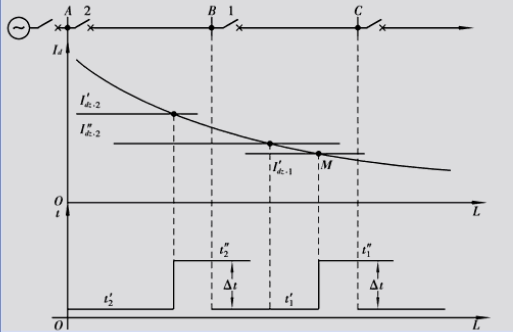

# 第一章 结论

## 1.1 电力系统继电保护的作用

### 1 继电保护的含义

继电保护包括继电保护技术和继电保护装置

继电保护技术：是一个完整的体系，它主要包括电力系统故障分析、各种继电保护原理及实现方法、继电保护的设计、继电保护运行及维护等技术。

继电保护装置：是完成继电保护功能的核心。继电保护装置就是能反应电力系统中电气元件发生故障或不正常运行状态，并动作于断路器跳闸或发出信号的一种自动装置。

### 2 电力系统的故障和不正常运行状态（三相交流系统）

#### 故障：

- 各种短路（d(3)、d(2)、d(1)、d(1-1)）和断线（单相、两相）

- 其中最常见且最危险的是各种类型的短路。
- 短路的危害
  - 电流I增加：危害故障设备和非故障设备
  - 电压U降低或增加：影响用户的正常工作
  - 破坏系统稳定性：使事故进一步扩大（系统振荡、电压崩溃）
  - 发生不对称故障时，出现I2（负序电流），使旋转电机产生附加发热；发生接地故障时出现I0（零序电流），对相邻通讯系统造成干扰。

#### 不正常运行状态

- 电力系统中电气元件的正常工作遭到破坏，但没有发生故障的运行状态
- 如：过负荷、过电压、频率降低、系统振荡等。

#### 继电保护的作用

- 当电力系统发生故障时，自动、迅速、有选择性地将故障元件从电力系统中切除，使故障元件免于继续遭到破坏，保证其它无故障设备迅速恢复正常运行。
- 反映电气元件的不正常运行状态，并根据运行维护条件（例如有无经常值班人员）而动作于发生信号、减负荷或跳闸。

## 1.2 继电保护的基本原理、构成与分类

### 1.2.1 基本原理

- 原则上说：只要找出正常运行与故障时系统中电气量或非电气量的变化特征（差别），即可找出一种原理，且差别越明显，保护性能越好。
- 为区分系统正常运行状态与故障或不正常运行状态，必须找出两种情况下的区别。
- I增加：   故障点与电源间   ——》过电流保护
- U降低： 母线电压——》低电压保护
- 相位变化 
  - 正常：为负荷的功率因数角，一般为0-30^0^
  - 短路：为输电线路的阻抗角，一般为60-85^0^  ——》方向保护
- 测量阻抗降低，模值减少 ——》阻抗保护
- 双侧电源线路外部故障：I~入~=I~出~；内部故障：I&ne;I~出~     ——》电流差动保护
- 反映负序、零序的序分量保护等
- 非电气量：瓦斯保护、过热保护

### 1.2.2保护装置的构成

- 以电流保护为例

/image-20240312130905919.png)

- 一般由测量部分、逻辑部分和执行部分三个部分构成。

  /image-20240312131117416.png)

  - 测量部分：测量从被保护对象输入的有关物理量（如电流、电压、阻抗、功率等）并与给定的整定值进行比较，根据比较结果给出“是”、“非”、“大于”、“不大于”等具有“0”或“1”性质的一组逻辑信号，从而判断保护是否该动作。

  - 逻辑元件：根据测量部分输出 量的大小、性质、输出 的逻辑状态、出现的顺序或它们的组合，使保护装置按一定的布尔逻辑及时序逻辑工作，最后确定是否应跳闸或发信号，并将有关命令传给执行元件。
    - 逻辑回路有：或、与、非、延时启动、延时返回、记忆等。
  - 执行元件：根据逻辑元件传送的信号，最后完成保护装置所担负的任务。
    - 故障时——》跳闸；不正常运行时——》发信号；正常运行时——》不动作。

### 1.2.3 继电保护的分类

- 按照保护原理分类
  - 过电流保护
  - 低电压保护
  - 高（过）电压保护
  - 功率方向保护
  - 阻抗（距离）保护
  - 差动保护
  - 暂态分量保护
  - 非电气量保护
- 按照故障类型分类
  - 相间故障保护
  - 接地故障保护
  - 匝间短路保护
  - 非全相运行保护等
- 按照保护所起的作用分类
  - 主保护
    - 满足系统稳定和设备安全要求，能以最快速度有选择地切除被保护设备和线路故障的保护
  - 后务保护（近后备、远后备）
    - 主保护或断路器拒动时用来切除故障的保护
  - 辅助保护
    - 为补充主保护和后备保护的性能或当主保护和后备保护退出运行而增设的简单保护。
- 按被保护设备分类
  - 线路保护
  - 发电机变压器组保护
  - 变压器保护
  - 母线保护
  - 断路器失灵保护
  - 电动机保护等
- 按照保护装置的硬件结构分类
  - 电磁型保护
  - 晶体管型保护
  - 集成电路型保护
  - 微机型保护

## 1.3 对电力系统继电保护的基本要求

- 对于反映电力系统故障而作用于断路跳闸的继电保护，电力系统对其的基本要求为具有选择性、速动性、灵活性和可靠性（四性）

### 1.3.1 选择性

- 指继电保护动作时，仅将故障元件或线路从电力系统中切除，使系统无故障部分继续运行。

  /image-20240312133327131.png)

- 选择性就是故障点在区内就动作，在区外不动作。

- 当主保护未动作时，由近后备或远后备切除故障，使停电面积最小。

### 1.3.2 速动性

- 指继电保护以允许而又可能的最快速度动作于断路器的跳闸，断开故障元件或线路。
- 快速切除故障的好处：
  1. 提高系统的稳定性
  2. 减少用户在低电压下的动作时间；
  3. 减少故障元件的损坏程度，避免故障进一步扩大。
     - 一般的快速保护动作时间为0.06-0.12S，最快的可达0.01-0.04S.
     - 一般的断路器的动作时间为0.06-0.15S，最快的可达0.02-0.06S.
     - 切除故障的最快时间为：0.03-0.1S.

### 1.3.3 灵敏性

- 继电保护对设计规定的保护范围内发生故障及异常运行状态的反应能力

  - 继电保护的灵敏性一般指在最不利条件下，保护装置对故障的反应能力
  - 对反应于数值上升而动作的过量保护（如电流保护）

  /image-20240312134153429.png)

  - 对反应于数值下降而动作的欠量保护（如低电压保护）

  /image-20240312134250412.png)

### 1.3.4 可靠性

- 对电力系统继电保护的基本性能要求，即要求保护在应动作时，不拒动；保护在不应动作时，不误动。
- 影响可靠性有内在的和外在的因素：
  - 内在的：装置本身的质量，包括元件好坏、结构设计的合理性、制造工艺水平、内外接线简明，触 户口卡多少等；
  - 外在的：运行维护水平、安装调试是否正确。

## 1.4 继电保护的发展

/image-20240312141713043.png)

不同类型的继电保护装置性能比较

/image-20240312141818476.png)

继电保护及自动装置技术未来趋势是向计算趋势是向计算机化网络化，一体化发展。

# 第二章 电网的电流保护和方向性电流保护

## 2.1 单侧电源网络相间短路的电流保护

- 输电线路发生相间短路时，电流会突然增大，故障相间的电压会降低。利用电流的这一特征，就可以构成电流保护
- 电流保护主要包括
  - 无时限电流速断保护
  - 限时电流速断保护
  - 定时限过电流保护
- 电流继电器是实现电流保护的基本元件。电流继电器是反应于一个电气量而动作的简单继电器的典型。

### 2.1.1 反应单一电器量的继电器

- 电流继电器按照电流工作原理可分为电磁型、感应器、晶体管型、集成电路型

- 电磁型继电 器（电磁型电压继电器工作原理与电流继电器基本相同）

  - 电流继电器KA  

    符号 /image-20240312155948206.png)

  - 电压继电器KV                    

  ​       符号 /image-20240312160048842.png)

- 电磁继电器的基本结构形式有螺管线圈式、吸引衔铁式和转动舌片式三种

- 电流继电器在电流保护中用作测量和起动元件，它是反应电流超过一整定值而动作的继电器。

  /image-20240312160443963.png)

- 电磁型继电器动作分析

  - 继电器动作的条件：为使继电器动作，必须增大电流，通过增大电流来增大电磁转矩，当电磁 力矩大于弹簧的作用力矩及摩擦力矩之和时，保护动作。
    - 动作电流：使继电器动作的最小电流值，称为继电器的动作电流（起动电流）

  - 继电器的返回条件：继电器动作后，当电流减小时，继电器在弹簧的作用下将返回。为使继电器返回，弹簧的作用力矩必须大于电磁力矩及摩擦力矩之和。
    - 返回电流：使继电器返回原位的最大电流值，称为继电器的返回电流。
    - 返回系统：返回电流和起动电流的比值，称为继电器的返回系统。

  - 继电特性：无论动作或返回，继电器从起始位置到终止位置是突发性的，它不可能停留在某一个中间位置。

- 辅助继电器

  - 时间继电器KT
    - 图形符号：/image-20240312161416025.png)
    - 作用：用来建立保护装置的动作时限

  - 中间继电器KM
    - 图形符号：/image-20240312162639279.png)
    - 作用：用以同时接通或断开几条独立回路和用以代替小容量触点或者带有不大延时来满足保护的需要。

  - 电磁型信号继电器KS
    - 图形符号：/image-20240312162702220.png)
    - 作用：用以在保护动作时，发出灯光和音响信号，并对保护装置的动作起记忆作用，以便分析保护装置动作情况和电力系统故障性质。

### 2.1.2 电流速动保护

- 仅反应电流增大而能瞬时动作切除故障的保护，称为电流速断保护，也称为无时限电流速断保护（也称电流I段）

- 1、几个基本概念

  - 短路电流与故障点位置的关系：

    /image-20240312163421354.png)

  

  - 三相短路电流计算：

    /image-20240312163507540.png)

  - 系统最大运行方式

    - 在被保护线路末端发生短路时，系统等值阻抗最小，通过保护装置的短路电流为最大的运行方式

  - 系统最小运行方式

    - 在同样短路条件下，系统等值阻抗最大，通过保护装置的电流为最小时的运行方式。系统等值阻抗的大小与投入运行的电气 设备及线路的多少等有关。

  - 最大短路电流

    - 在最大运行方式下三相短路时通过保护装置的电流为最大，称之为最大短路电流

  - 最小短路电流

    - 在最小运行方式下两相短路时，通过保护装置的短路电流为最小，称之为最小短路电流。

- 2、保护装置的整定

  - 保护装置的起动值：
    - 对因电流升高而动作的电流保护来讲，使起动保护装置的最小电流值称为保护装置的起动电流
    - 保护装置的起动值是用电力系统的一次侧参数表示的，当一次侧的短路电流达到这个数值时，安装在该处的这套保护装置就能够起动
  - 保护装置的整定
    - 所谓整定就是根据对继电保护的基本要求，确定保护装置的起动值（一般情况下是指电力系统一次侧的参数）、灵敏性、动作时限等过程。

- 3、电流速断保护原理及整定计算

  - 基本原理

    /image-20240312165023763.png)

  - 以保护2为例

    - 当本线路末端d1点短路时，希望速断保护2能够瞬时动作切除故障。
    - 当相邻线路的始端（习惯上又称为出处）d2点短路时，按照选择性的要求。速断保护2就不应该动作，因为该处的故障应由速断保护1动作切除。

  - 优先保证动作的选择性

    - 从保护装置起动参数的整定上保证下一条线路出口处短路时不起动，在继电器保护技术中，这又称为按躲开下一条线路出口处短路的条件整定
    - 一般情况下速断保护只保护被保护线路的一部分。

- 4、整定计算

  - 动作电流
    - 整定原则：保护装置的起动电流应按躲开下一条线路出口处通过保护的最大短路电流（最大运行方式下的三相短路电流）来整定，
    - 即：                         /image-20240312170259011.png)
    - 可靠系数：             /image-20240312170338919.png)
    - 三相短路电流：     /image-20240312163507540.png)

- 5、保护的灵敏性

  - 用保护范围的大小来衡量
  - 通常用线路全长的百分数来表示
  - 当基本原理图可见，当系统为最大运行方式时，电流速断的保护范围为最大。
  - 当出现系统最小运行方式下的两相短路时，电流速断的保护范围为最小
  - 一般情况下，应按最小运行方式、两相短路电流来校验其保护范围
    - 最大保护范围——L~max~$\geq$50%L
    - 最小保护范围——L~min~$\leq$15%L无意义

- 原理接线图及其特点

  - 单相原理接线图

    /image-20240312174803184.png)

    - 中间继电器KM的作用
      - 增大接点容量
      - 增大装置动作时间（0.06-0.08S）
    - QF辅助接点的作用：保护KM的接点

  - 特点

    - 优点：动作迅速，简单可靠
    - 缺点：
      - 不能保护线路全长，单独使用不能作为主保护；
      - 保护范围直接受系统运行方式变化 的影响。

  - 保护的使用情况

    - 当系统运行方式变化很大，或者被保护线路的长度很短时，速断保护就可能没有保护范围。因而不能采用。
    - 在个别情况下，有选择性的电流速断也可以保护线路全长，例如当电网的终端线路上采用线路——变压器组的接线方式时

- 5、小结

  - 仅靠动作电流值来保证其选择性
  - 能无延时地保护本线路的一部分（不是一个完整的电流保护）

### 2.1.3 限时电流速断保护

- 限时电流速断保护（也称电流II段）：能以较小的时限快速切除全线路范围以内的故障的保护。

- 一、保护的要求及基本工作原理

  1. 要求

     - 在任何情况下都能保护本线路的全长，并具有足够的灵敏性。
     - 在满足上述要求的前提下，具有最小的动作时限。

  2. 特点

     - 能保护线路全长，快速切除故障，兼作电流速断保护的后备

  3. 工作原理

     - 保护范围必然要延伸到下一条线路中去，当下一条线路出口处发生短路时，保护起动。

     - 为了保证动作的选择性，就必须使保护的动作带有一定的时限

     - 为了尽量缩短时限，其保护范围不超出下一条线路速断保护的范围。 

       

- 二、整定计算的基本原则

  - 1、动作电流

    - 整定原则：保护装置的起动电流应按躲过下一条线路电流速断保护范围末段发生短路时最大短路电流（或躲过下一条线路电流I段的整定值 ）来整定
    - 即/image-20240313133448079.png)
    - 可靠系数：/image-20240313133425700.png)

  - 2、动作时限的选择

    - 限时速断的动作时限应选择得比下一条线路电流速断保护的动作时限高出一个时间阶段

      /image-20240313133404792.png)

    - $\Delta$​t的大小与断路器跳闸时间、时间继电器动作时间的误差、延时返回的惯性时间等有关。一般取0.5s。

      /image-20240313133324862.png)

  - 3、限时电流速断保护动作的配合

    - 当线路上装设了电流速断和限时电流速断保护后，它们的联合工作就可以保证全线路范围内的故障都能够在0.5s的时间以内予以切除。

  - 4、保护装置灵敏性校验

    - 为了能够保护本线路的全长，限时电流速断保护必须在最小运行方式下，线路末端发生两相短路时，具有足够的反应能力。
    - 通常用灵敏系数来衡量/image-20240313134426427.png)
    - 灵敏系统的计算
      - 一般采用最小运行方式发生两相短路时的短路电流来计算。即/image-20240313134737977.png)
    - 保证灵敏系数大于1的原因
      - 可能为非金属性短路，使短路电流减小
      - 实际的短路电流小于计算值 
      - 电流互感器引起的负误差
      - 保护装置中的继电器可能具有的正误差
      - 考虑一定的裕度
    - 灵敏度不满足要求时的调整
      - 动作电流/image-20240313135030544-1710327031884-1.png)
      - 动作时限/image-20240313135101696.png)

- 三、限时电流速断保护的单相原理接线图/image-20240313135523569.png)

- 四、小结

  - 限时电流速断保护的保护范围大于本线路全长
  - 依靠动作电流值和动作时间共同保证其选择性
  - 与第I段共同构成被保护线路的主保护，兼作第I段的后备保护。

### 2.1.4 定时限过电流保护

- 定时限过电流保护（也称电流III段）：指其起动电流按照躲开最大负荷来整定的一种保护装置
  - 保护的作用
    - 作为本线路主保护的近后备以及相邻下一线路保护的远后备。

- 一、工作原理和整定计算的基本原则
  - 1、工作原理
    - 正常时不应该动作，短路时起动并以时间来保证动作的选择性。

    - 2、整定计算的基本原则

      - 动作电流

        - 整定原则：按躲过本线路最大负荷电流来整定。同时保证在外部故障切除后，保护装置能够返回。

        - 即/image-20240313184839970.png)

          /image-20240313184902902.png)

        - 保护装置的起动电流/image-20240313185018306.png)
        - 可靠系数/image-20240313185042721.png)

  - 2、动作时限的选择

    - 保护装置的选择性只有依靠使各保护装置带有不同的时限来满足
    - 按阶梯原则整定。即/image-20240313185642187.png)
    - 动作时限与流过电流大小无关/image-20240313185619354.png)

    - 一般来说，任一过电流保护的动作时限，应选择得比相邻各元件保护的动作时限均高出至少一个$\Delta$t，只有这样才能充分保护动作的选择性。
    - 即/image-20240313190618160.png)
    - /image-20240313190647954.png)

  - 4、保护装置灵敏性校验——灵敏系数的计算

    - 近后备
      - 采用最小运行方式下本线路末端两相短路时的短路电流来校验。即/image-20240313192041345.png)
    - 远后备
      - 采用最小运行方式下相邻线路末端两相短路时的电流进行校验。即/image-20240313191028049.png)

- 三、限时电流速断保护的单相原理接线图

  - 与第II段相同，只是电流继电器的定值与时间继电器定值不同。

- 四、小结

  - 第III段的动作电流比第I、II段的动作电流小得多，其灵敏度比第I、II段更高
  - 在后备保护之间，只有灵敏系数和动作时限都互相配合时，才能保证选择性
  - 保护范围是本线路和相邻下一线路全长
  - 电网末端第III段的动作时间可以是保护中所有元件的固有动作时间之各（可瞬时动作），故可不设电流速断保护；末级线路保护亦可简化（I+III或II+III），越接近电源，动作时间越长，应设三段式保护。

- 例题

  - 如图所示网络和已知条件。试对保护1进行三段式电流保护整定计算。

  - 设Z1=0.4$\Omega$/km, K^'^k=1.25，K^"^k=1.1,Kk=1.2,K~zq~=1.5,Kh=0.85,t~3max~=0.5s

    /image-20240313193056839.png)

  - 1、保护1电流I段整定计算

    - （1）求动作电流。按躲过最大运行方式下本线路末端（即B母线处）三相短路时流过保护的最大短路电流整定，即/image-20240314101426876.png)
    - (2)、动作时限。为保护固有动作时间，即t1=0s
    - (3)、灵敏性校验，即求保护范围
      - 在最大运行方式下发生三相短路时的保护范围为/image-20240314103713311.png)
      - 最小运行方式下发生两相短路时的保护范围为/image-20240314104148046.png)

  - 2、保护1电流II段整定计算

    - （1）求动作电流。按与相邻线路保护2的I段动作电流相配合的原则整定，即/image-20240314101702814-1710400624983-1.png)
    - （2）动作时限。应比相邻线路保护2的I段动作时限高一个时限级差$\Delta$​t，即/image-20240314101844190.png)
    - （3）灵敏系数校验。利用最小运行方式下本线路末端（即B母线处）发生两相金属性短路时流过保护的电流来校验，即/image-20240314102027385.png)

  - 3、保护1电流III段整定计算

    - (1)求动作电流。按躲过本线路可能流过的最大负荷电流来整定，即
    - /image-20240314102156994.png)
    - (2)动作时限。应比相邻线路保护的最大动作时限高一个时限级差$\Delta$t，即
    - /image-20240314102437780.png)
    - (3)灵敏系数校验
      - 1)作近后备时。利用最小运行方式下本线路末端现相金属性短路时流过保护的电流校验灵敏系数，即/image-20240314102806605.png)
      - 2)作远后备时。利用最小运行方式下相邻线路末端发生两相金属性短路时流过保护的电流校验灵敏系数，即/image-20240314103504701.png)

### 2.1.7 电流保护的接线方式

- 1.含义：

  - 指保护中电流继电器与电流互感器二次线圈之间的连接方式
  - **接线系数**指流入电流继电器的电流与电流互感器二次侧电流的比值

- 2.常用的两种接线方式

  - 分类：对相间短路的电流保护。目前广泛使用的是

    - 三相星形接线（也称为完全星形接线）
    - 两相星形接线（也称为不完全星形接线）

  - 1)三相星形接线的特点

    - 每相上均装有CT(电流互感器)和LJ（电流继电器），均为Y形接线
    - LJ的触点并联（或）
    - 接线系数为1
    - 可以反应各种相间短路和中性点直接接地电网中的单相接地短路。
    - /image-20240314105423474.png)

  - 2)两相星形接线的特点

    - 仅在两相上装设CT和LJ、构成不完全Y形接线
    - LJ的触点并联（或）(通常接A、C相)
    - 接线系数为1
    - 可以反应各种相间短路
    - /image-20240314105643030.png)

  - 3)保护装置的起动电流与继电器的起动电流

    /image-20240314105855033.png)

    - **I**~dz.J~:继电器的动作电流值（启动电流）

      **I**~dz~:整定的动作电流值

      n~l~：电流互感器变比

  - 4)两种接线方式的性能比较

    - 1）对中性点直接接地电网和非直接接地电网中的各种短路

      - 对各种相间短路，两种接线方式均正确反映。

    - 2)对于中性点直接接地电网的单相接地短路

      - 完全星形接线可以反应各种单相接地短路
      - 不完全星形接线不能反应全部的单相接地短路（如B相接地），所以不适用于中性点直接接地电网。

    - 3)对中性点非直接接地电网中不同线路不同相的两点接地短路

      - 在小接地电流系统中，发生异地两点接地时，一般只要求切除一个接地点，而允许带一个接地点继续运行一段时间

        - 异地两点接地发生在相互串联的两条线路上：

          - 三相星形接线：保护1和保护2之间有配合关系，100%切除后一线路

          - 两相星形接线：2/3机会切除后一条线。（即1/3机会无选择性动作）

            /image-20240314111308832.png)

      - 异地两点接地发生在相互并联的两条线路上：

        - 三相星形接线：当线路I和线路II的过流保护动作时间相同时，保护1和保护2同时动作，切除线路I、II。

        - 两相星形接线：2/3机会只切一条线路。

        - 注意：两LH必须装置同名的两相，否则 可能出现两套保护均不动作的情况。

          /image-20240314111632917.png)

    - 4)Y/$\Delta$​接线变压器后d^(2）^

    - 以Y/$\Delta$——接线降压为例d^(A、B）^

    - /image-20240314114305442.png)/image-20240314114356884.png)

    注：对降压变压器，短路电流按相序后者大ABCA,例如AB相短路，B相电流大

    ​       对降压变压器，短路电流按相序后者大ABCA,例如AB相短路，A相电流大

  - 结论：

    - 当Y/$\Delta$变压器的后侧发生两相短路时，滞后相电流是其它两相电流的两倍，并与它们反相位。
    - 当Y/$\Delta$变压器的Y侧发生两相短路时，超前相电流是其它两相电流的两倍，并与它们反相位
    - 三相星形接线灵敏度是两相星形接线的两倍
      - 当过电流保护接于降压变压器的高压加以作为低压侧线路故障的后备保护时，如果保护是采用三相星形接线，则接于B相上的继电器由于流有较其它两相大一倍的电流，因此灵敏系数增大一倍。
      - 为提高电流保护对Y/$\Delta$变压器后两相短路的灵敏性，采取的措施：在两相星形接线的中线上再接入一个LJ，此种接线方式称为两相三继电器接线方式。以提高灵敏性。
      - /image-20240314131838827.png)

- 3.两种接线方式的应用

  - 三相星形接线：发电机、变压器的后备保护，采用电流保护作为大电流接地系统的保护（要求较高的可靠性和灵敏性）。
  - 两相星形接线：中性点不接地电网或经高阻接地电网中。（注：所有线路上的保护装置应安装在相同的两相上。A、C相）

### 2.1.8 阶段式电流保护的应用及评价

- 一、阶段式电流保护的配合
- /image-20240314132747751.png)
- 二、具有电流速断、限时电流速断和过电流保护的单相原理接线图
- /image-20240314134048239.png)
- 评价
  - 选择性：
    - 在单侧电源辐射网中，保护具有较好的选择性（靠动作电流、动作时限），但在多电源或单电源环网等复杂网络中可能无法保证选择性。
  - 灵敏性：
    - 受运行方式的影响大，往往满足不了要求。——电流保护的缺点
  - 速动性：
    - 第I、II段满足
    - 第III段越靠近电源，动作时限越长——缺点
  - 可靠性
    - 线路越简单，可靠性越高——优点
- 应用范围
  - 35KV及以下的单电源辐射状网络，中性点不直接接地系统，I和II段共同构成主保护，第III段作为后备保护
  - 中性点直接接地系统一般不使用阶段式电流保护，但第I段保护可以作为110KV以上线路的辅助保护。

## 2.2 电网相间短路的方向性电流保护

### 2.2.1 方向性电流保护的工作原理

- 一、问题的提出
  - 为提高供电的可靠性，出现了单向环形供电网络、双电源或多电源网络。但在这样的网络中简单的电流保护不能满足要求。分析好下：
  - /image-20240315101510097.png)
  - 对电流速断保护：
    - d1处短路，要求I~d1~<I~dz3~^'^，断路器2的I段电流大于断路器3的I段电流，否则保护3误动，
    - d2处短路，要求I~d2~<I~dz2^'^，断路器3的I段电流大于断路器2的I段电流否则 保护2误动。
  - 对过电流保护：d1处短路，要求t3>t2；d2处短路时，要求t2>t3；显然 ，这种要求是矛盾的。
- 二、几个概念
  - 1)短路功率：指系统短路时某点电压与电流相乘所得到的感性功率。在不考虑串联电容和分布电容在线路上短路时，短路功率从电源流向短路点。
  - 2)故障方向：指故障发生在保护安装处的哪一侧，通常有正向故障和反向故障之分，它实际上是根据短路功率的流向进行区分的。
    - 正方向故障：从保护安装（可按电流互感器）处看出去，在“母线指向线路”方向上发生的故障
    - 反方向故障：从保护安装（可按电流互感器）处看出去，在“线路指向母线”方向上发生的故障
    - /image-20240315103009890.png)
- 三、原因分析：反方向故障时，对侧电源提供的短路电流引起保护误动。
- 四、解决办法：
  - 利用方向元件与电流元件结合就构成了方向电流保护
  - 由于元件动作具有一定的方向性，可在反向故障时把保护闭锁。
  - 正方向故障时方向电流保护才可能动作，按正方向分组。
  - /image-20240315104258575.png)
  - 这样双侧电源系统保护系统变成针对两个单侧电源的子系统。
  - /image-20240315104627695-17104887885511.png)
  - 由上图可见
    - 保护1、3、5只反映由左侧电源提供的短路电流，它们之间应相互配合
    - 保护2、4、5只反映由右侧电源提供的短路电流，它们之间应相互配合，矛盾得以解决。
- 五、方向过电流保护的原理接线图
  - /image-20240315105151765.png)
  - 构成
    - 方向元件1
    - 电流元件2
    - 时间元件3
    - 信号继电器4
    - 跳闸线圈TQ  
  - 工作原理
    - 方向元件和电流元件必须都动作以后，才能去起动时间元件，再经过预定的延时后动作于跳闸。

### 2.2.2 功率方向继电器的工作原理

- 含义：

  - 功率方向继电器：用于判别短路功率方向或测定电压电流间的夹角的继电器，简称为方向元件。由于正、反向故障时短路功率方向不同，它将使保护的动作具有一定的方向性。
  - 在常规保护中，方向元件有电磁型、感应型、整流型、晶体管型、集成电路型等，常用的是整流型和晶体管型

- 一、功率方向继电器的工作原理

  - 母线电压参考方向为“母线指向大地”，电流参考方向为“母线指向线路”

  - 1、故障方向的判断

    - 利用判别短路功率方向或电流、电压之间的相位关系，就可以判别发生故障的方向。
    - /image-20240315142604324.png)

  - 2、对继电保护中方向继电器的基本要求

    - 1）应只有明确的方向性，即在正方向发生各种故障时（包括故障点有过渡电阻的情况）时，能可靠动作，而在反方向故障时，可靠不动作。
    - 2）故障时继电器的动作有足够的灵敏性

    3、功率方向继电器的实现——动作特性

    - 1）最大灵敏角：在UJ、IJ、幅值不变时，其输出（转矩或电压）值随两者之间的相位差的大小而改变。当功率输出为最大时的相位差称为最大灵敏角。
    - 2）/image-20240315145240578.png)
    - 动作范围：
      - 动作方程：/image-20240315145046632.png)
      - 或/image-20240315145112365.png)
      - 或/image-20240315145134590.png)
    - 动作特性：
      - 当/image-20240315150037733.png)线路发生三相短路
      - 所以/image-20240315150114379.png)
      - /image-20240315150357579.png)

  - 4、死区：当正方向出口短路时，/image-20240315150219568.png)，GJ不动——电压死区。消除方法：采用90度接线方向、加记忆回路。

### 2.2.3 集成电路型功率方向继电器

- 一、构成继电器的框图

  - 整流型方向继电器的基本环节包括：电压形成回路、移相、整流滤波回路、比较回路和执行元件等几部分

  - /image-20240315151458834.png)

  - 动作方程：/image-20240315151539200.png)

  - 1、电压形成回路

    - 变换成适合于集成运算放大器所需要的电压
    - 并与电压、电流互感器的二次回路相隔离

    2、移相

    ​	形成/image-20240315153200713.png)，以便于/image-20240315153228608.png)比较

    3、整流滤波回路

    - 滤去谐波分量
    - 形成方波。（在输入信号正半周时，输出为高电平；输入信号负半周时，输出为低电平）

    4、比较回路

    - 与门：输入均为“1”时，输出高电平
    - 或门（应为或非门）：输入均为“0”时，输出高电平
    - 延时5ms展宽20ms：5ms对应角度为90^0^。延时超过5ms表明电压与电流夹角小于90^0^，保护动作。

- 二、相位比较回路

  - 1、测量两个电压瞬时值同时为正的持续时间

    /image-20240315154108305.png)

- 三、功率方向继电器的动作特性

  - 1、角度特性：当I~J~为常数时，动作电压U~J~与$\phi$~J~之间的关系曲线。

  - /image-20240315154330098.png)

    - 在保护动作范围内，最小起动电流基本上与$\phi$~J~无关，
    - 当加入继电器的电压小于最小起动电压时。继电器将不能起动，这就是出现“电压死区”的原因。

  - 2、伏安特性：表示当/image-20240315154727846.png)固定不变时，继电器起动电压/image-20240315154801302.png)的关系曲线

    /image-20240315154659649.png)

    - 在理想情况下，该曲线平等于两个坐标轴
    - 只要加入继电器的电流和电压分别大于最小起动电流和最小起动电压，继电器就可以动作。

  - 3、潜动

    - 指在只加入电流或只加入电压的情况下，继电器就能够动作的现象
    - 只加入电流：电流潜动
    - 只加入电压：电压潜动
    - 危害：在反方向出口处三相短路时，此时/image-20240315155116286.png)，而加入的电流很大，方向继电器本应将保护装置闭锁，如果此时出现了潜动，就可能使保护装置因失去方向性而误动作。

- 四、幅值比较原理和相位比较原理及其互换关系

  - 对于比较两个电气量的继电器，可按幅值比较原理或相位比较原理来实现

    - 幅值比较原理：/image-20240315155418099.png)，此时保护动作，否则保护不动作。
    - 相位比较原理：/image-20240315155442712.png)

  - 幅值比较原理与相位比较原理之间具有互换性

    - 注：

      - 1、必须是同一频率的正统交流量/image-20240315155615601.png)
      - 相位比较原理的动作边界为/image-20240315155631164.png)，即-90^0^和90^0^之间

    - 用四边形法则来分析它们之间的关系

      /image-20240315155833807.png)

      更正：上式中最后一行两个公式是减号，非加号

### 2.2.4 相间短路功率方向继电器的接线方式

- 一、功率方向继电器的接线方式

  - 1、含义：功率方向继电器的接线方式：继电器与电流互感器和电压互感器之间的连接方式；
  - 2、要求：
    - 1）必须保证功率方向继电器具有良好的方向性。即正向发生任何类型的故障都能动作，而反向故障时则不动作
    - 2）尽量使功率方向继电器在正向故障时具有较高的灵敏度，$\phi$~k~接近$\phi$~lm~；
  - 3、90^0^接线方式：
    - 指系统三相对称且cos$\phi$=1时，/image-20240317141418203.png)的接线方式
    - /image-20240317141450181.png)
    - 采用该接线方式构成的感想方向过电流保护的原理接线图
    - /image-20240317142100941.png)
- 二、相间短路情况下90^0^接线功率方向继电器动作行为分析。

  - 1、正方向三相短路。
    - 1）动作分析
    - /image-20240317143145465.png)
      - 由于三相对称，三只继电器动作情况相同，故以A相为例分析
      - 从图中可见，/image-20240317142939073.png)/image-20240317143002756.png)
      - 为使功率方向继电器动作最灵敏：/image-20240317143050281.png)
      - 到功率方向继电器内角：/image-20240317143125045.png)
    - 2）内角的选择
      - 为使P~JA~>0
      - 一般/image-20240317143848382.png)
      - 当/image-20240317143918502.png)，/image-20240317144111711.png)
      - 当/image-20240317143943521.png)，/image-20240317144016398.png)
      - 所以，在三相短路时，选择/image-20240317144138614.png)，可保证GJ动作。
  - 2、正方向两相短路，以BC两相短路为例，且穿载运行
    - 有两种极限情况：出口和远处
      - 1）近处BC相短路动作分析
        - /image-20240317191609829.png)
        - 其向量图为/image-20240317192136276.png)
        - GJA:/image-20240317192201550.png)，不动作。
        - GJB:/image-20240317192230916.png)，同三相短路
        - GJC：/image-20240317192300463.png)，同三相短路
        - 应选择/image-20240317192325706.png)，使得/image-20240317192348351.png)时GJ能动作
        - 注：
          - 出口BC两相短路，/image-20240317192431678.png)、/image-20240317192458766.png)幅值很B、C相功率方向断电器动作
          - 该接线方式可消除各种两相短路的死区。

    - 2）远处BC相短路动作分析/image-20240317193730276.png)
      - /image-20240317193752835.png)
      - 保护安装地点的电压
      - GJA:/image-20240317193925997.png),不动作
      - GJB:/image-20240317193953054.png)，所以应选择/image-20240317194021334.png)，使得B相GJ能动作。
      - GJC:/image-20240317194051950.png)，所以应选择/image-20240317194116629.png)，使得C相GJ能动作

  - 3、功率方向继电器内角的确定
    - 为保证/image-20240317194451853.png)时，GJ在正方向任何相间短路时均能动作，继电顺内角取值 应在这三个不等式的范围肉，/image-20240317194533414.png)。
    - 最大灵敏角/image-20240318130851521.png)
    - 继电器动作最灵敏的条件，应根据三相短路时使/image-20240318130956353.png)来决定。因此，对某一已经确定阻抗角的送电线路而言，应采用/image-20240318131054817.png)，以便获得最大的灵敏度。
    - 用于保护相间短路的LG—11型功率方向继电器，内角具有两个值/image-20240317194655447.png)和/image-20240317194715527.png)。

  - 4、对90^0^接线方式的评价
    - 优点：
      - 对各种两相短路都没有死区
      - 适当选择内角后，对线路上各种相间故障保证动作的方向性

    - 缺点：不能清除/image-20240317194918401.png)死区。

  - 正方向各种短路时，方向继电器能够正确动作的内角范围
  - /image-20240318130314977.png)
- 方向电流保护的整定有两个方面的内容：
  - 一是电流部分的整定，即动作电流、动作时间与灵敏度的检验
  - 二是方向元件是否需要装设（投入）

- 一、电流速断保护
  - /image-20240318210336920.png)
  - 1、不加方向元件时，分别计算整定电流，取较大的。/image-20240318210510338.png)
    - 优点：不需增设方向继电器、无电压死区
    - 缺点：保护范围小

  - 加方向元件时，/image-20240318210617841.png)
    - 分别整定后，如果反方向的故障电流大于动作值，就需要加方向元件，否则不需要加。此保护1不需要方向元件。

- 二、限时电流速断保护
- 
  - 其基本的整定原则仍与下一级保护的电流速断相配合。
  - 需考虑保护安装地点与短路点之间有电源或线路的影响。
  - 1、助增、外汲
    - 助增：分支电路上有电源时，使故障线路电流增大的现象
    - /image-20240318212052432.png)

  - 外汲：分支电路 为一并联线路，使故障线路短路电流减小的现象
    - /image-20240318212706866.png)

- 2、分支系数
  - /image-20240318213440738.png)
  - 仅有助增时：/image-20240318213312006.png)
  - 仅有分汲时：/image-20240318213328592.png)
  - 当变电所母线上既有电源又有并联的线路时，其分支系数可能大于1，也可能小于1，此时应根据实际可能的运行方式确定。
  - 单侧电源供电的线路，实即为/image-20240318213257264.png)的一种特殊情况。

- 3、动作电流的整定计算
  - /image-20240318213756399.png)
  - 分支系数的选取应根据实际可能的运行方式，选取最小值进行整定计算。

- 三、定时限过电流保护
  - 1、动作电流：其动作电流的整定按躲过最大负荷电流及灵敏度相配合等原则来速写2
  - 2、动作时限 
    - 将动作方向一致的保护，各自独立按阶梯性原则进行
    - /image-20240319131854859.png)
- 方向性保护的总体评价
  - 1、优点：
    - 在单电源环形网络和多电源辐射型电网中，都能保护动作的选择性
  - 2、缺点
    - 理论上当保护安装地点附近正方向发生三相短路是，由于母线电压降低为零，保护装置拒动，出现“死区”。运行经验指出，三相短路的几率很小。
    - 保护中采用了方向元件使接线复杂，投资增加，可靠性降低。
- 例题：
  - 如图示输电网络，在各断路器上装有过电流保护，已知时限级差为0.5s。为保证动作的选择性，确定各过电流保护的运用时间及哪些保护要装设方向元件
  - /image-20240319140112397.png)
  - 答：/image-20240319140149068.png)
  - /image-20240319141348216-1710846828823-1.png)
  - /image-20240319141417582.png)
  - 保护2、3、4、6、7应加方向元件

## 2.3 中性点直接接地电网中接地短路的零序电流及方向保护

- 当中性点直接接地的电网中发生接地短路时，将出现很大的零序电流，可利用零序电流来构成接地短路的保护
- 接地故障时零序电流，零序电压及零序功率的特点
  - 零序电流的方向：由母线流向故障点为正。
  - 零序电压的方向：线路高于大地的电压为正。

## 2.4 中性点非直接接地电网中单相接地故障的零序电压、电流及方向保护

